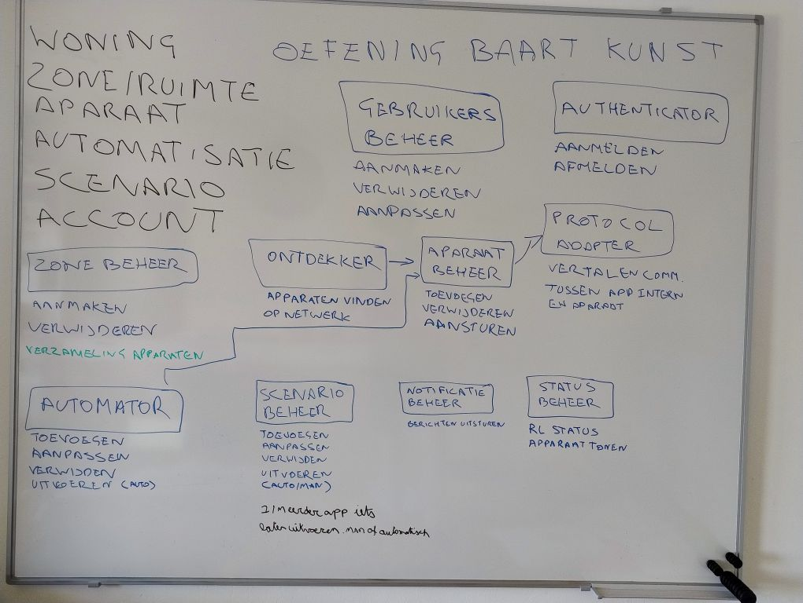

# Gepersonaliseerde opdracht
Je klant wil een applicatie voor het beheren van slimme woningen, waarbij apparaten van verschillende merken geïntegreerd worden. Automatisaties en scenario’s moeten configureerbaar zijn. Vergelijkbare voorbeelden zijn Google Home en Home Assistant.

> Veronderstel in de eerste plaats dat de afgestudeerde versie van je team deze opdracht productieklaar moet maken op een half jaar tijd. In je ADR's kan je vermelden welke beslissingen anders zouden zijn als je team en je budget groter / kleiner waren.
> Voor de vraag "wat de klant waarschijnlijk belangrijk vindt" kijk je naar de gegeven voorbeelden.

# Requirements
## Expliciet (rechstreeks uit opgave):
*	Apparaten verschillende merken integreren in app
*	App voor beheren van slimme apparaten in woning
*	Automatisaties moeten configureerbaar zijn
* Scenarios moeten configureerbaar zijn

## Impliciet (tussen de lijntjes):
*	Bediening met touch 
*	Aansturing via spraak (uitbereiding)
*	OS-ondersteuning – Android
*	Cross-platform (uitbereiding)

# Karakteristieken
1.	Useability
2.	Interoperability
3.	Configurability
4.	Security
5.	Maintainability
6.	Reliability
7.	Performance

# Logische componenten
De workflow methode lijkt het meeste aangewezen om logische componenten te kunnen achterhalen. In de werking van de app zijn volgende elementen alvast te onderscheiden

