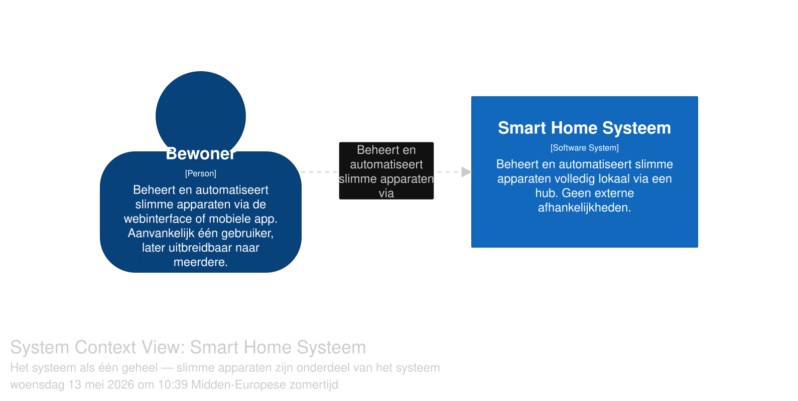
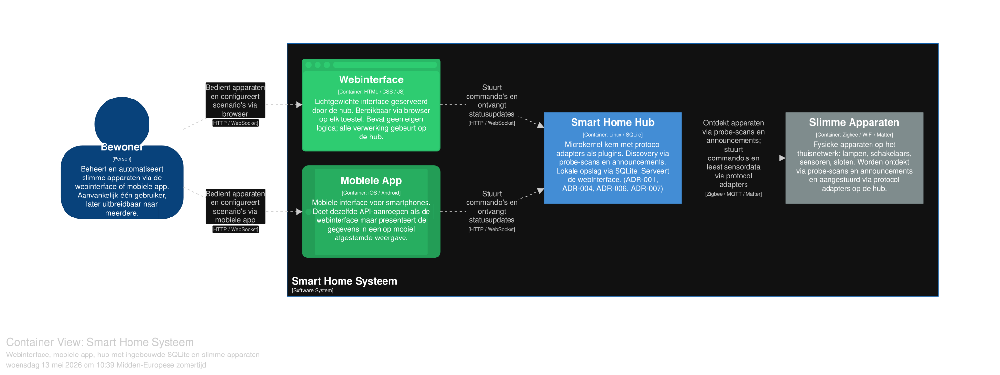
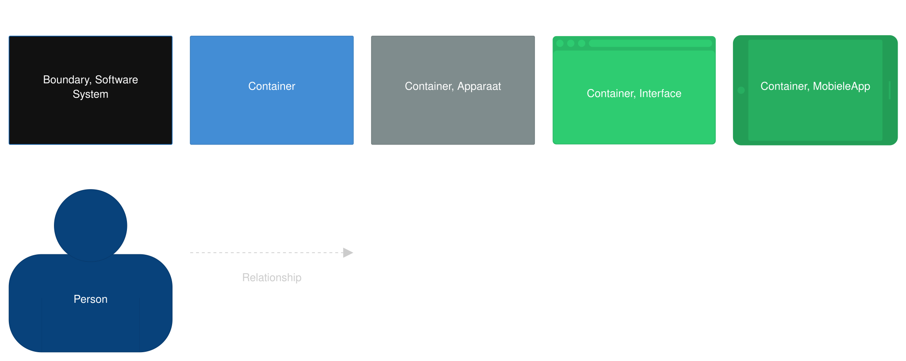
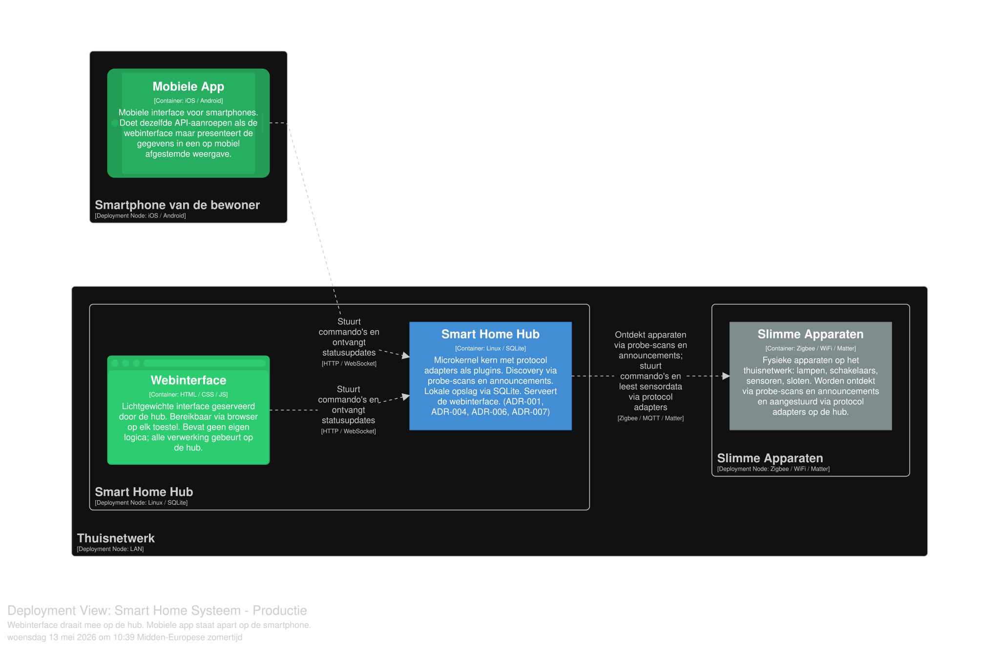
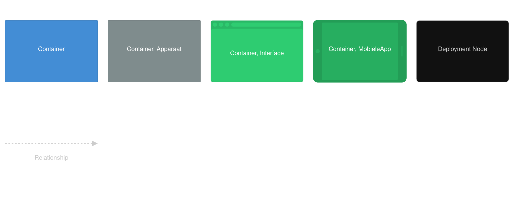

# Gepersonaliseerde opdracht
Je klant wil een applicatie voor het beheren van slimme woningen, waarbij apparaten van verschillende merken geïntegreerd worden. Automatisaties en scenario’s moeten configureerbaar zijn. Vergelijkbare voorbeelden zijn Google Home en Home Assistant.

> Veronderstel in de eerste plaats dat de afgestudeerde versie van je team deze opdracht productieklaar moet maken op een half jaar tijd. In je ADR's kan je vermelden welke beslissingen anders zouden zijn als je team en je budget groter / kleiner waren.
> Voor de vraag "wat de klant waarschijnlijk belangrijk vindt" kijk je naar de gegeven voorbeelden.

# Requirements
## Expliciet (rechstreeks uit opgave):
*	Apparaten verschillende merken integreren in app
*	App voor beheren van slimme apparaten in woning
*	Automatisaties moeten configureerbaar zijn
* Scenarios moeten configureerbaar zijn

## Impliciet (tussen de lijntjes):
*	Bediening met touch 
*	Aansturing via spraak (uitbereiding)
*	OS-ondersteuning – Android
*	Cross-platform (uitbereiding)

# Karakteristieken
| Karakteristiek | Expliciet? | Top 3? | Toelichtig |
| -------------- | ---------- | ------ | ---------- |
| Useability     | ja         | ja     | Hoe gebruiksvriendelijk is de app. Hoe draagt de app bij aan de gebruikerservaring. |
| Interoperability | ja       | ja     | Hoe gemakkelijk is het om verschillende merken/apparaten te integreren. |
| Configurability  | ja       | ja     | In welke mate het mogelijk is om zaken te configureren in de app.  |
| Security | nee | nee | In welke mate apparaten afgeschermd zijn en de app cyberaanvallen kan weerstaan. |
| Maintainability | nee | nee | Hoe gemakkelijk de app op termijn te onderhouden valt. |
| Reliability | nee | nee | Hoe betrouwbaar de werking van de app is. |
| Performance | nee | nee | In welke mate de prestaties van de app worden beïenvloed door verschillende factoren. |

# Logische componenten
De workflow methode lijkt het meeste aangewezen om logische componenten te kunnen achterhalen. In de werking van de app zijn volgende elementen alvast te onderscheiden

| component | taken |
| --------- | ----- |
| zone beheer | zones aanmaken / verwijderen |
| gebruikers beheer | gebruiker aanmaken / aanpassen / verwijderen |
| authenticator | gebruiker aanmelden / afmelden |
| ontdekker | apparaten vinden op netwerk |
| aparaat beheer | apparaten toevoegen / verwijderen / aansturen |
| protocol adapter | apparaat commando's vertalen |
| scenario beheer | scenario toevoegen / aanpassen / verwijderen / uitvoeren |
| notificatie beheer | berichten tonen ivm app werking |
| status beheer | realtime status van apparaten tonen |

# Architecturale beslissingen
## 001 architecturale stijl

### STATUS
Accepted

### CONTEXT
Deze adr gaat over het kiezen van een architecturale stijl. Volgende vergelijkingen zijn gemaakt:

**Layered**
- Adapters zitten ingebouwd. Vereist update van de app voor nieuwe integraties [interoperability-/maintainability-]
- Aanpassingen businesslogica raken meerdere lagen [maintainability-]

**Modulaire Monoliet**
- Adapters zitten ingebouwd. Vereist update van de app voor nieuwe integraties [interoperability-/maintainability-]
- (2de dealbreaker benoemen)

**Microkernel**
- Adapters kunnen als plugins bestaan, los van de kern [interoperability+/maintainability+]
-Minder code door minimale kern [security+/maintainability+/performance+/reliability+]

**Microservices**
- Moeilijk om consistente UX te garanderen [useability-] (wat wordt hiermee bedoeld?)
- Veel overhead door onderlingen communicatie services [performance-]

### BESLISSING
Er wordt gekozen voor een microkernel architectuur.

### GEVOLGEN
(moet nog aangevuld worden)

### GOVERNANCE
hoe ga je ervoer zorgen dat developers niet ineens toevoegingen doen die buiten de stijl vallen? (nog aan te vullen)

### NOTITIES
nvt

## 002 Lokaal vs Cloud vs Hybride

### STATUS
Accepted

### CONTEXT
Er is de afweging te maken om de app volledig lokaal, volledig in de cloud of volgens een hybride model te laten werken.
Binnen een lokale model beperkt de communicatie zich tot het lokale netwerk.
Binnen een cloud model verloopt alle communicatie via een cloud server (extern).
Binnen een hybride model veerloopt de communicatie via een cloud servern, enkel lokaal of een combinatie van beiden.

### BESLISSING
Er wordt gekozen voor een lokale model.

### GEVOLGEN
#### Voordelig
+ **[performance]** zeer snelle response en directe verwerking
+ **[security]** betere privacy en controle over data
+ werkt volledig offline, geen internet vereist

 #### Nadelig
- geen automatische synchronisatie tussen apparaten
- beperkte mogelijkheid voor toegang op afstand
- updates en backups moeten lokaal worden beheerd

### GOVERNANCE
nvt

### NOTITIES
In een latere uitbreiding wordt overgegaan tot een hybride model

## 003 lokaal aansturen van aparaten

### STATUS
Accepted

### CONTEXT
Er zijn verschillende manieren om aparaten over het lokale netwerk aan te sturen
- Enkel de app gebruiken
- app + hub

### BESLISSING
Een hub zal gebruikt worden om de aparaten centraal (vanop het netwerk) aan te sturen. Een interne web app zal dienen als interface voor de gebruiker tot de hub.

### GEVOLGEN
#### Voordelig
+ **[useability]** een hub kan automatische acties onafhankelijk van een mobiele app uitvoeren.
+ **[security]** apparaten zijn makkelijker af te schermen omdat ze via een centraal punt op het netwerk moeten benaderd worden.
#### Nadelig
- **[reliability]** een hub vormt een single point of failure

### GOVERNANCE
nvt

### NOTITIES
nvt

## 004 Strategie voor het ontdekken van apparaten op het netwerk

### STATUS
Accepted

### CONTEXT
Om apparaten van verschillende merken te kunnen beheren, moet de applicatie eerst weten welke
apparaten beschikbaar zijn op het thuisnetwerk. Dit is een fundamentele stap — zonder een
goede discovery strategie kan de applicatie haar kernbelofte van **interoperability** niet
waarmaken.

Er zijn twee gangbare manieren waarop apparaten ontdekt kunnen worden:

**Probe-based discovery**

De applicatie neemt zelf het initiatief en stuurt een vraag uit op het netwerk. Apparaten die
deze vraag ontvangen, antwoorden met hun aanwezigheid. De applicatie heeft volledige controle
over wanneer dit gebeurt.

**Announcement-based discovery**

De applicatie opent een tijdvenster en wacht. Apparaten die zichzelf willen kenbaar maken,
sturen uit zichzelf een bericht. De applicatie vangt deze berichten op.

Het probleem is dat niet elk merk of protocol dezelfde methode ondersteunt. Sommige apparaten
reageren enkel op een actieve vraag, andere kondigen zichzelf enkel zelf aan. Een keuze voor
slechts één methode sluit dus automatisch een deel van de markt uit — wat rechtstreeks ingaat
tegen onze karakteristiek **interoperability**.

### BESLISSING
**We kiezen ervoor om beide methodes te ondersteunen, uitgevoerd na elkaar op expliciete
vraag van de gebruiker.**

Discovery start pas wanneer de gebruiker actief aangeeft een apparaat te willen toevoegen.
Er is geen achtergrondproces dat continu meeluistert. Het systeem voert eerst een probe uit,
opent daarna een venster voor announcements, en toont uiteindelijk één gecombineerde lijst
van gevonden apparaten. Apparaten die via beide methodes gevonden worden, verschijnen slechts
één keer in die lijst.

Welke technische methode gebruikt werd om een apparaat te vinden is een intern detail dat niet
zichtbaar is voor de gebruiker.

### GEVOLGEN
#### Voordelig
+ **[Interoperability]** Geen enkel apparaat wordt uitgesloten op basis van welke discovery
  methode het ondersteunt. Beide gevallen worden gedekt.
+ **[Security]** Omdat de applicatie enkel actief scant op vraag van de gebruiker, is ze
  buiten dat moment niet vatbaar voor apparaten of aanvallers die berichten uitsturen op het
  netwerk. Een continu luisterende applicatie zou een groter aanvalsoppervlak hebben.
+ **[Usability]** De gebruiker ziet één duidelijke lijst van beschikbare apparaten, zonder
  technische details over hoe ze gevonden werden.
+ **[Performance]** Er is geen continu achtergrondverkeer op het netwerk. Netwerkbelasting
  beperkt zich tot de momenten waarop de gebruiker actief apparaten zoekt.

#### Nadelig
- **[Maintainability]** Twee discovery methodes ondersteunen is complexer dan één. Beide
  moeten correct geïmplementeerd en onderhouden worden.
- **[Gebruikerservaring]** De gebruiker wacht op twee opeenvolgende scanvensters voordat
  het volledige resultaat zichtbaar is.

### GOVERNANCE
- Alle discovery logica wordt ondergebracht in de **Apparaat-discovery** component zodat
  toekomstige wijzigingen aan één methode geen impact hebben op de rest van het systeem.
- De duur van elk scanvenster wordt instelbaar gemaakt zodat dit later bijgesteld kan worden
  zonder aanpassingen aan de code.

### NOTITITES
- **Als team groter / budget groter:** beide methodes zouden gelijktijdig kunnen draaien in
  plaats van na elkaar, wat de wachttijd voor de gebruiker halveert.
- **Als team kleiner / budget kleiner:** enkel probe-based discovery zou volstaan als
  vereenvoudigde aanpak. Dit dekt de meeste moderne apparaten en is eenvoudiger te beveiligen.
- Deze ADR beslist over de **strategie** van discovery. Er kunnen aparte ADR's gemaakt worden
  over welke specifieke protocollen gebruikt worden voor probe en announcement — denk aan keuzes
  zoals mDNS, SSDP, Zigbee permit join of Matter commissioner discovery. Omwille van de scope
  van dit project worden die beslissingen hier niet verder uitgewerkt, maar het is een bewuste
  keuze om dit op te merken.

#### Referenties
- [mDNS — RFC 6762](https://www.rfc-editor.org/rfc/rfc6762)
- [Matter — Wat is Matter? (Homey)](https://homey.app/nl-be/wiki/wat-is-matter/)
- [Zigbee — Connectivity Standards Alliance](https://csa-iot.org/all-solutions/zigbee/)
- [SSDP/UPnP — Tutorial en gebruikersgids (Macchina)](https://docs.macchina.io/edge/00200-UPnPSSDPTutorialAndUserGuide.html)
- [SSDP — Protocol uitleg (StormWall)](https://stormwall.network/resources/terms/protocols/ssdp)
- [Bonjour — Apple developer documentatie](https://developer.apple.com/bonjour/)

## 005 Account verplicht voor gebruik van de applicatie

### CONTEXT
De applicatie is bedoeld voor het beheren van slimme woningen met apparaten van verschillende merken. Gebruikers moeten apparaten kunnen bedienen, scenario’s configureren en later mogelijk rechten of zones kunnen beheren. De groep heeft besproken of de applicatie ook zonder account bruikbaar zou moeten zijn, maar dat zou het moeilijker maken om gebruikers te onderscheiden, instellingen op te slaan en toegang goed te beveiligen.

### BESLISSING
We kiezen ervoor dat een account verplicht is om de applicatie te gebruiken. Elke gebruiker moet zich aanmelden met een persoonlijk account voordat hij of zij toegang krijgt tot de woning, apparaten en configuraties. Dit account vormt de basis voor authenticatie, persoonlijke instellingen en toegangscontrole.

#### Motivatie
Voor een smart-home applicatie is een account belangrijk omdat de app niet alleen apparaten moet bedienen, maar ook moet weten wie welke actie uitvoert. Dat is nuttig voor beveiliging, personalisatie en toekomstige uitbreiding naar meerdere gebruikers of rechten per zone. Een verplicht account geeft de beste combinatie van controle, uitbreidbaarheid en duidelijkheid voor deze projectscope.

### GEVOLGEN
#### Voordelig
+ **[Security]** verbeterd door authenticatie en toegangscontrole.
+ **[Usability]** iets meer instapwerk, maar een gepersonaliseerde ervaring na login.
+ **[Configurability]** instellingen kunnen per gebruiker worden bewaard.
+ **[Maintainability]** de structuur is overzichtelijker dan een volledig accountloos systeem.
+ Gebruikersinstellingen kunnen per account worden opgeslagen.
+ Toegangscontrole wordt duidelijker en veiliger.
+ De app kan later makkelijker worden uitgebreid naar meerdere gebruikers of rollen.
+ Acties kunnen beter gelogd of gekoppeld worden aan een specifieke gebruiker.

#### Nadelig
- **[Usability]** Gebruikers moeten zich registreren en aanmelden voordat ze de app kunnen gebruiken.
- Er is extra werk nodig voor login, accountbeheer en validatie.
- Er moet rekening gehouden worden met privacy, opslag en beveiliging van gebruikersgegevens.

### NOTITIES
#### Alternatieven
1. **Geen account**

   De app zou volledig zonder login werken. Dat verlaagt de drempel voor de gebruiker, maar maakt het moeilijk om gebruikers te onderscheiden, rechten toe te kennen en instellingen per persoon op te slaan. Ook wordt het beveiligingsmodel dan zwakker, omdat men dan vooral op netwerkbeveiliging moet vertrouwen.

2. **Meerdere accounts vanaf het begin**

   Elke gebruiker zou meteen een eigen account krijgen met mogelijke rollen en rechten. Dit biedt de meeste flexibiliteit, maar maakt de eerste versie van het project complexer op vlak van implementatie, testen en onderhoud. Voor een tweedejaars eindproject is dit waarschijnlijk te zwaar als basisoplossing.

3. **Eén verplicht account**

   Elke gebruiker heeft één persoonlijk account nodig om de app te gebruiken. Dit is de beste balans tussen eenvoud en functionaliteit: de app blijft haalbaar voor de eerste versie, maar ondersteunt wel security, persoonlijke voorkeuren en latere uitbreiding naar meerdere gebruikers.

#### Aandachtspunten toekomstige beslissingen
Als de scope later uitbreidt, kan deze beslissing worden verfijnd met extra ADR’s voor:
* gastaccounts,
* meerdere gebruikers per woning,
* rollen en rechten per zone,
* of een hybride loginmodel.

## 006 Automatisaties opgebouwd bovenop scenario's

### STATUS
Accepted

### CONTEXT
De smart-home applicatie moet zowel eenvoudige manuele acties als automatische woninglogica ondersteunen. In bestaande systemen worden deze concepten soms samengevoegd, wat leidt tot meer complexiteit en een minder begrijpelijke gebruikerservaring.

Er is een behoefte aan:
- eenvoudige manuele bediening (bv. "Filmavond")
- automatische uitvoering op vaste momenten of events (bv. elke vrijdag om 20u)

### BESLISSING
Er wordt gekozen voor een model waarbij:
- Scenario's een verzameling van acties vertegenwoordigen die manueel kunnen worden uitgevoerd
- Automatisaties specifiek scenario's automatisch activeren op basis van tijds- of event-gebaseerde triggers

### GEVOLGEN
#### Voordelig
+ **[Usability]** Gebruikers kunnen een scenario (bv. Filmavond) zowel manueel activeren als automatisch laten uitvoeren (bv. elke vrijdagavond).
+ **[Configurability]** Gebruikers kunnen zelf instellen wanneer en hoe scenario's verlopen, inclusief tijdstippen, herhalingen en uitzonderingen.
+ **[Maintainability]** Scenario's en tijdsgebonden logica zijn modulair opgebouwd, waardoor functionaliteit herbruikbaar is en aanpassingen eenvoudig kunnen gebeuren zonder impact op andere onderdelen.
+ Scenario-definitie en automatische activatie zijn logisch gescheiden. Dit zorgt voor een duidelijke scheiding van verantwoordelijkheden.

#### Nadelig
- **[Reliability]** Automatisaties zijn gekoppeld aan scenario's; indien een scenario foutief geconfigureerd is of faalt, kan dit de automatische uitvoering beïnvloeden.
- Er is bijkomende logica nodig om de relatie tussen scenario's en automatisaties te onderhouden.

### GOVERNANCE
**Eigenaar:** Domeinarchitect / Functioneel architect

**Review moment:**
- bij uitbreiding van automatisatie-types
- bij introductie van complexere afhankelijkheden (bv. geneste scenario's)

### NOTITIES
Deze beslissing sluit aan bij de gekozen karakteristieken usability, configurability, maintainability en reliability, en ondersteunt een event-driven architectuur zonder de gebruikerservaring onnodig complex te maken.

## 007 Beheer van woningen

### STATUS
Accepted

### CONTEXT
De app beheert slimme apparaten in een woning.
Er werd bekeken of een gebruiker meerdere woningen moet kunnen beheren, zoals een huis en een vakantiehuis. Dit zou zorgen voor extra schermen, meer databankrelaties en moeilijkere validatie.

### BESLISSING
De app ondersteunt voorlopig slechts één woning per gebruiker. Deze keuze werd gemaakt om de eerste versie van de app eenvoudig en stabiel te houden.

### GEVOLGEN
#### Voordelig
+ **[Usability]** De app blijft eenvoudig te gebruiken.
+ **[Maintainability]** De code en databank blijven eenvoudiger.
+ **[Performance]** Minder complexiteit zorgt voor betere prestaties.
+ **[Development speed]** Het team kan sneller een stabiele versie maken.
#### Nadelig
- **[Functionaliteit]** Gebruikers kunnen maar één woning beheren.
- **[Schaalbaarheid]** Later uitbreiden naar meerdere woningen vraagt extra werk.

### NOTITIES
De beslissing kan later aangepast worden als meerdere woningen belangrijk worden voor gebruikers.
Ondersteuning voor meerdere woningen wordt later toegevoegd.

# Diagrammen
## Systeem context

## Container

## Deployment

# Proofs of concept
Onderstaande tabel toont een overzicht van de proofs-of-concept die zijn opgesteld voor dit project. Meer informatie over een POC staat in de readme van de POC zelf

| POC | map |
| --- | --- |
| Device discovery - announcement | ./poc_annon/ |
| Device discovery - probe | ./poc-device-discovery/ |
| Authentication plugin | ./poc_auth_plugin/ |
| Scenario's & Automatisatie | ./poc-scenario/ |

