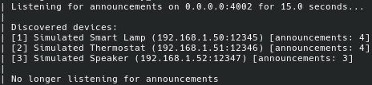
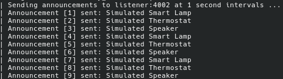

# inleiding
Deze POC is gebaseerd op ADR-004 en gaat over announcement-based device discovery.

Het doel van deze POC is om specifiek volgende vraagstelling te beantwoorden:
> Hoe zou de applicatie gedurende een instelbare tijd announcements van apparaten opvangen, verwerken en tonen in een lijst

# Werking
De POC bestaat uit 2 delen
- een announcer
- een device listener

De `announcer` simuleert announcements die apparaten periodiek via het netwerk zouden uitsturen om zichzelf aan te kondigen.

Normaal zouden deze announcements broadcast of multicast zijn. Omdat Docker Swarm Mode uit zichzelf geen broadcast of multicast verkeer ondersteund is er hier gewerkt met unicast berichten.

De `device listener` luisterd op het netwerk naar announcements van apparaten, enkel tijdens een vooraf ingestelde tijd.


Elke announcement heefd een eigen ID. Aan de hand van ID's kan vergeleken worden melke announcement leidde tot de ontdekking van een apparaat.





# gebruik
```
docker build -t poc-device-discovery:latest
docker stack deploy -c poc.yaml device-discovery

# Na 15 seconden (timeout listener)
docker service logs device-discovery_announcer
docker service logs device-discovery_listener
```
